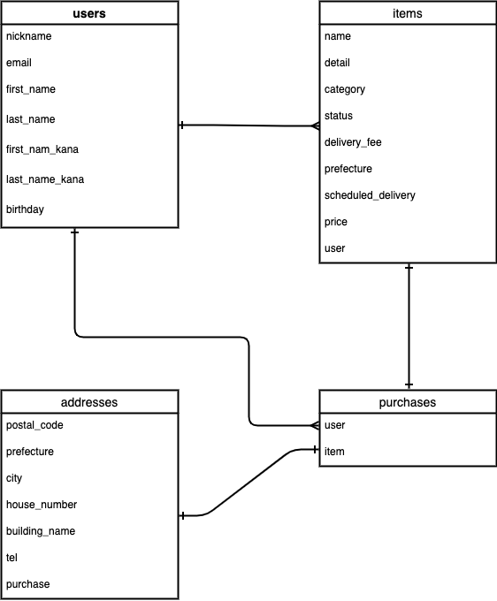

# アプリ名
furima-37363

# アプリケーションの概要
フリーマーケットのようにユーザー間で売買・商取引が行えるサービスアプリ

# URL
Heroku
https://furima-37363.herokuapp.com/

Basic認証
・ID: admin
・Pass: 2222

# テスト用アカウント
出品者用
・メールアドレス名: momi@momi
・パスワード: a123456
購入者用
・メールアドレス: ringo@ringo
・パスワード: a123456
購入用カード情報(PAYJPテスト用)
・番号：4242424242424242
・期限：3月/33年（未来の年月であれば可能）
・セキュリティコード：123

# 利用方法
1.トップページ（一覧ページ）のヘッダーからユーザー新規登録を行う
2.ユーザーを登録すると商品を出品することができる
3.出品した商品は、編集と削除をすることができる
4.他のユーザーが出品した商品は、クレジットカードを用いて購入することができる

# 実装機能
## トップページ

## 1.ユーザー登録機能
必要な情報を入力するとユーザーの新規登録ができます。
ユーザー登録することで出品・購入できるようになります。

## 2.商品出品機能
商品画像を選択し商品情報を入力すると出品することができます。

## 3.商品編集機能
出品した商品を編集することができます。

## 4.商品削除機能
出品した商品を削除することができます。

## 5.商品購入機能
出品者以外であれば、カード情報と配送先を入力すると商品を購入することができます。
クレジット決済機能はPAY.JPを使用しております。

# ER図
  

# テーブル設計

## users テーブル

| Column                           | Type      | Options                   |
| -------------------------------- | --------- | ------------------------- |
| nickname	                       | string    | null: false               |
| email	                           | string    | null: false, unique: true |
| encrypted_password               | string    | null: false               |
| first_name	                     | string    | null: false               |
| last_name                        | string    | null: false               |
| first_name_kana                  | string    | null: false               |
| last_name_kana                   | string    | null: false               |
| birthday                         | date      | null: false               |

### Association

- has_many :items
- has_many :purchases

## items テーブル
| Column                   | Type       | Options                        |
| ------------------------ | ---------- | ------------------------------ |
| name                     | string     | null: false                    |
| price                    | integer    | null: false                    |
| detail                   | text       | null: false                    |
| category_id              | integer    | null: false                    |
| status_id                | integer    | null: false                    |
| delivery_fee_id          | integer    | null: false                    |
| prefecture_id            | integer    | null: false                    |
| scheduled_delivery_id    | integer    | null: false                    |
| user                     | references | null: false, foreign_key: true |

### Association
- belongs_to : user
- has_one : purchase

## purchases テーブル
| Column                 | Type       | Options                        |
| ---------------------- | ---------- | ------------------------------ |
| user                   | references | null: false, foreign_key: true |  
| item                   | references | null: false, foreign_key: true |  

### Association
- belongs_to : user
- belongs_to : item
- has_one : address

## addresses テーブル
| Column                 | Type        | Options                        |
| ---------------------- | ----------- | ------------------------------ |
| postal_code            | string      | null: false                    |
| prefecture_id          | integer     | null: false                    |
| city                   | string      | null: false                    |
| house_number           | string      | null: false                    |
| building_name          | string      |                                |
| tel                    | string      | null: false                    | 
| purchase               | references  | null: false, foreign_key: true | 

### Association
- belongs_to :purchase

# 開発環境
・Ruby
・Ruby on Rails
・MySQL
・Github
・AWS
・Visual Studio Code

# ローカルでの動作方法
% https://github.com/kawayuyu/furima-37363.git
% cd furima-37363
% bundle install
% rails db:create
% rails db:migrate
% yarn install

# 工夫したポイント
使い勝手を突き詰めるために、作業工程を分割して細かくリリースしたことです。
1つずつ実装→デプロイをすることで、使い勝手を試しながら実装することができ、
より知識が深まりました。